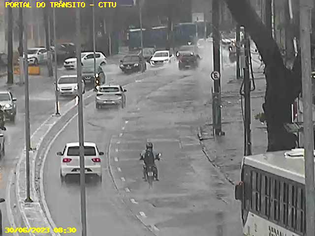
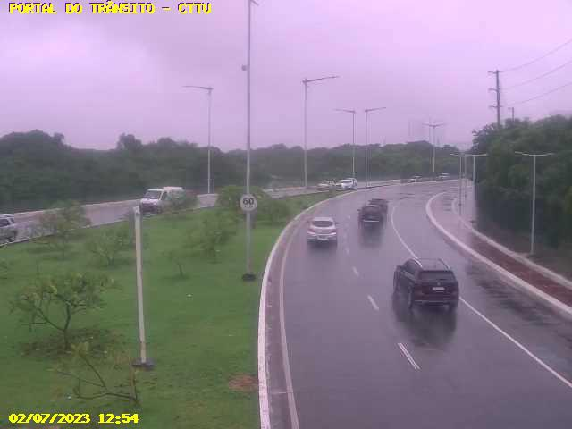
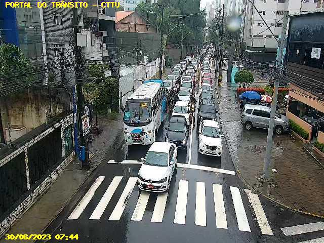
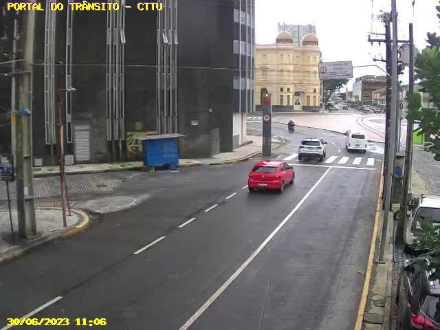

# Traffic Classification and Flooding Detection from Traffic Cameras
The project involves the classification of images captured by traffic cameras operated by the Urban Traffic and Transportation Company (CTTU) in Recife, Pernambuco, Brazil.  The aim is to identify heavy traffic conditions and instances of road flooding. This project utilizes transfer learning with pretrained TensorFlow models, specifically Mobilenet_v2 and Inception_v3.

*** This project is under construction ***

## Description

Two distinct classifications were performed. The first classification aimed to identify whether there is heavy traffic at a particular location, while the second classification focused on detecting instances of flooding on the roads. Recife is known for having one of the worst traffic congestions in the world (source: [Moovit Insights Public Transit Index](https://moovitapp.com/insights/en/Moovit_Insights_Public_Transit_Index-countries)). Additionally, the city frequently experiences road flooding during rainy days due to its low-lying geography and inadequate infrastructure.

The first phase of the project was built in the Google Colab environment, with the purpose of utilizing simplified integration with Google Drive and the available GPU. In the next stage, the plan is to build an application using Streamlit (with the model already saved and preloaded).

The CTTU website (https://cttu.recife.pe.gov.br/cameras-da-cttu) provides access to 104 traffic cameras spread across the city. Clicking on a camera displays a real-time image of the corresponding location (a single photo, not a video).

### Image retrieving

In the initial phase, the Selenium package was used to retrieve camera images. The images were stored on Google Drive. Due to the website's significant response time (approximately 8 seconds to load an image), there is no risk of generating a high number of requests. It is important to note that the image quality is not high (less than 100 KB), making it impossible to identify vehicle license plates or pedestrians, thereby preserving privacy.

Here are examples of a camera image for each class:

#### - Flooding:



#### - No flooding:



#### - Traffic:



#### - Low traffic:



The script was executed at different times, including periods of heavy and light traffic. It was also run during rainy days to capture images of flooding. Subsequently, a manual screening of the images was performed, categorizing them into the relevant classes of interest.

Due to the nature of the CTTU website, it is important to note that camera unavailability and image loading issues are common occurrences, affecting approximately one-third of the cameras. Furthermore, there is an imbalance in the dataset, with fewer images available for flooding and heavy traffic classes. This class imbalance has not yet been addressed.

## Building the model

The transfer learning approach with the pretrained TensorFlow models (Mobilenet_v2 and Inception_v3) yielded promising results, as described below:

### Flooding Classification
- 10 epochs:
  - Accuracy: 0.9225
  - Confusion Matrix:
    ```
    [[ 71  10]
     [ 21 298]]
    ```
  Approximately 87% accuracy in the flooding class.

### Traffic Classification
- 10 epochs:
  - Accuracy: 0.9219409282700421
  - Confusion Matrix:
    ```
    [[696  23]
     [ 51 178]]
    ```
  Approximately 77% accuracy in the traffic class (class with fewer samples) with only 10 epochs.

## Results

The initial results are promising and demonstrate how it's possible to use transfer learning in open solutions. With a limited amount of data and reduced training time, it was possible to achieve an accuracy close to 90% in cases of flooded images.

This approach has the potential to produce support tools for cities at a very low cost and with a short development time, yielding excellent results. The City Hall of Recife has access to real-time camera images, enabling other solutions such as accident detection, traffic violations, etc.

In the specific case of Recife city, rainfall sensors are being installed to try to anticipate possible flooding (link: https://www2.recife.pe.gov.br/noticias/18/07/2023/prefeitura-conclui-instalacao-dos-primeiros-pluviometros-e-sensores-de).

The proposed tool could be complementary, offering a different approach to the problem. Perhaps with a more robust approach, such as developing a specific model for each camera.


## Next steps
Please note that further steps are required to address the class imbalance and improve the overall performance of the classification models.
